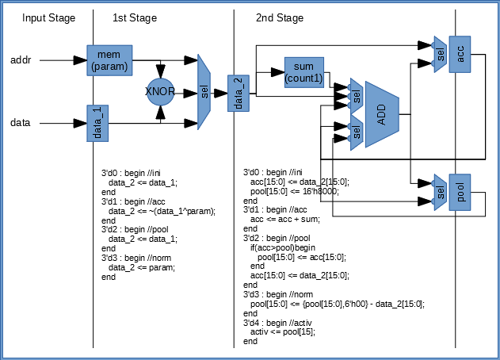
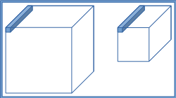
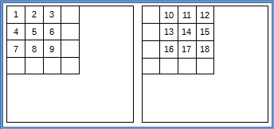

# BNN と TNN の推論実行環境構築中
学習済みパラメータを使ったバイナリニューラルネットアクセラレータ作成中です
### 準備
- データは[ここ](https://www.cs.toronto.edu/~kriz/cifar.html)から CIFAR-10 binary version (suitable for C programs) の test_batch.bin をダウンロードして cifar10-test にリネーム
- [ここ](https://github.com/tom01h/deep-learning-from-scratch) で作った学習済みパラメータを使う

```
$ ../mkparams.pl W1.h mean1.h var1.h W2.h mean2.h var2.h W3.h mean3.h var3.h W4.h mean4.h var4.h W5.h > ../paramn.h
```

### C 環境
実行法  
```
$ gcc params2b.c
$ ./a.out > paramb.h
$ gcc estimate.c -lm -o estimate
$ ./estimate
```

- BNN
  - 最初の100データだと 70% の認識精度
  - params.h を変換して paramb.h を作る (params2b.c)
    - mean2,3,4 を x.6 精度の FIXED INT に変換
    - データの並び順を C,Y,X から Y,X,C に変換
  - 2,3,4層のデータ型を整数化済み
  - Norm の直後に BinActiv(符号) なので var は不要
  - Activ 関数を呼んでいるところをすべて BinActiv にする （デフォルト）
- TNN **整数化保留**
  - 最初の100データだと 78% の認識精度
  - ./TNN/params.h.gz を解いて ./params.h にする
  - Activ 関数を呼んでいるところをすべて TriActiv にする
- バッチ処理していないのでとっても遅い

### Verilog 環境
実行法 (Verilatorが必要です)   
```
$ gcc params2mem.c
$ ./a.out > param0
$ make
$ ./sim/Vestimate
```
- BNN
  - params.h を変換して param0 を作る (params2mem.c)
  - 第1層はVerilog化しない
  - 第2,3,4層をVerilog化済み
  - 出力層以降はVerilog化しない
- 真面目にバイナリ化したので C 環境よりも速いみたい
---

## 推論アクセラレータ
パラメータは内蔵メモリ内に保持して、与えられたアドレスから読みだします。  
入力データは外から与えます。  
入力 x とメモリから読みだすウェイト WEIGHT は 32bit 幅で、入力の1チャンネル分を一度に処理します。  
こんな感じでパイプ化しました。これを32個並列実行します。  
実際には 1st Stage 前半は一つ上の階層にあります。  


### レジスタ
- PARAM (WEIGHT or MEAN)
- ACC
- POOL

### コマンド
- Init(bias)
  - 2: ACC ← bias (accの要素数)
  - 2: POOL ← -MAX
- Acc(addr, x)
  - 1: WEIGHT ← Mem(addr)
  - 2: ACC ← ACC + Popc(Xnor(WEIGHT, x))
- Pool(bias)
  - 2: POOL ← Max(ACC, POOL)
  - 2: ACC ← bias
- Norm(addr)
  - 1: MEAN ← Mem(addr)
  - 2: POOL ← POOL - MEAN
- Activ()
  - 2: Sign(POOL)

### 使用法
畳み込み層1階層分の計算例です。左の入力から右の出力を得る手順を説明します。奥行きがチャンネル方向で、面倒なので32の場合で説明します。  
  
入力データ幅の32ビットは入力チャンネルサイズなので、入力の青色の1本分のデータを一度に処理できます。面倒なので以降は平面で書きます。  
カーネルサイズが3×3で、poolingでX,Y方向をそれぞれ半分にするので、入力16ドットから出力1ドットが得られます。  
最初にInitで初期化します。次に、1から9の順にAccを実行して最初の畳み込みを計算します。Poolを実行すると、ACCの値がPOOLにコピーされます。  
次に10から18の順にAccを実行し、さらにPoolを実行します。最初の畳み込みよりもACCが大きければPOOLが更新されます。つぎはY方向にずらして以下同様に…  
  
4回繰り返して最大値が求まったらNorm、Activの順に実行し、1個の回路から1粒の出力を得ます。回路は32個並列に実装されているので、最初の絵の出力の青色1本分のデータを一度に得る事が出来ます。  
1本分の出力が終わったら、X方向に2個ずらして次の16ドットを繰り返します。X方向が終わったらY方向に2ドットずらして繰り返します。  
全結合層とかチャンネルサイズが64とかでも上手く行くとは思うのですが、大変そうなので説明は省きます。
