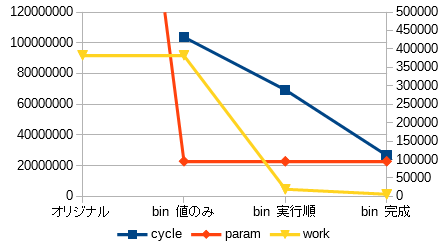

# BNN と TNN の推論実行環境構築中
学習済みパラメータを使ったバイナリニューラルネットアクセラレータ作成中です
### 準備
- データは[ここ](https://www.cs.toronto.edu/~kriz/cifar.html)から CIFAR-10 binary version (suitable for C programs) の test_batch.bin をダウンロードして cifar10-test にリネーム
- [ここ](https://github.com/tom01h/deep-learning-from-scratch) で作った学習済みパラメータを使う

```
$ ../mkparams.pl W1.h mean1.h var1.h W2.h mean2.h var2.h W3.h mean3.h var3.h W4.h mean4.h var4.h W5.h > ../params.h
```

### C 環境
- BNN
  - 最初の1000データだと 72.6% の認識精度
  - params.h を変換して paramb.h を作る (params2b.c)
    - mean2,3,4 を x.6 精度の FIXED INT に変換
    - データの並び順を C,Y,X から Y,X,C に変換
  - 2,3,4層のデータ型を整数化済み
  - Norm の直後に BinActiv(符号) なので var は不要

```
$ gcc params2b.c
$ ./a.out > paramb.h
$ gcc estimate.c -o estimate
$ ./estimate
```

なんかすごく負けた気がしますが、BNNだけ1,5層を整数化してFloatをなくしました。[ソース](https://github.com/tom01h/estimate-cnn/blob/a3716afd81e24c5a0d0e0fe16a9fce84ce9077a0/estimate.c)  
次に、下の```推論アクセラレータ```の```仕様法```に書いてある順で計算します。保存するデータをアクティベーション後のデータだけにすることで使用メモリ量を削減しました。ついでに結構速くなったようです。[ソース](https://github.com/tom01h/estimate-cnn/blob/5db29700ce188e95edac66567356262a1d111dc3/estimate.c)    
最後は XNOR とビットカウントを使った最適化です。[ソース](https://github.com/tom01h/estimate-cnn/blob/0a085e5acad9c894536e968f0ba43b4a2232de9c/estimate.c)    
下のグラフがざっと見積もった使用メモリの量と zero-riscy で1画像の推論を実行したときのサイクル数です。  


- QNN
  - 最初の1000データだと 75.6% の認識精度
  - 整数化のためにアクティベーションを 1/3→1, 1→3 にする
  - params.h を変換して paramq.h を作る (params2q.c)
    - mean2,3,4 を x.5 精度の FIXED INT に変換して3倍する(アクティベーション3倍のため)
    - var2,3,4 から std2,3,4 を計算
      - sqrt(var) を x.5 精度の FIXED INT に変換
      - アクティベーション時に 1/2 と比較用に使うので 3/2 倍する  
          (Norm 時に x を割る代わりに Activ 時に 1/2 に掛ける)
    - データの並び順を C,Y,X から Y,X,C に変換
  - 2,3,4層のデータ型を整数化済み

```
$ gcc params2q.c
$ ./a.out > paramq.h
$ gcc estimate_q.c -lm -o estimate
$ ./estimate_q
  ```

- バッチ処理していないのでとっても遅い

### Verilog 環境
~~BNNのみです。~~ QNN対応しました。一時的にBNN使用できません。  
実行法には Verilatorが必要です。   
- BNN
  - params.h を変換して param0 を作る (params2mem.c)
  - 第1層はVerilog化しない
  - 第2,3,4層をVerilog化済み
  - 出力層以降はVerilog化しない

```
$ gcc params2mem.c -lm
$ ./a.out
$ make
$ ./sim/Vestimate
```

- QNN
  - params.h を変換して param0 を作る (params2memq.c)
  - 第1層はVerilog化しない
  - 第2,3,4層をVerilog化済み
  - 出力層以降はVerilog化しない

```
$ gcc params2memq.c -lm
$ ./a.out
$ make -f Makefile.qua
$ ./sim/Vestimate
```

- 真面目にバイナリ化したので C 環境よりも速いみたい

---

## 推論アクセラレータ
パラメータは内蔵メモリ内に保持して、与えられたアドレスから読みだします。  
入力データは外から与えます。  
入力 x とメモリから読みだすウェイト WEIGHT は 32bit 幅で、入力の1チャンネル分を一度に処理します。  
こんな感じでパイプ化しました。これを32個並列実行します。  
実際には 1st Stage 前半は一つ上の階層にあります。  


### レジスタ
- PARAM (WEIGHT or MEAN)
- ACC
- POOL

### コマンド
- Init(bias)
  - 2: ACC ← bias (accの要素数)
  - 2: POOL ← -MAX
- Acc(addr, x)
  - 1: WEIGHT ← Mem(addr)
  - 2: ACC ← ACC + Popc(Xnor(WEIGHT, x))
- Pool(bias)
  - 2: POOL ← Max(ACC, POOL)
  - 2: ACC ← bias
- Norm(addr)
  - 1: MEAN ← Mem(addr)
  - 2: POOL ← POOL - MEAN
- Activ()
  - 2: Sign(POOL)

### 使用法
畳み込み層1階層分の計算例です。左の入力から右の出力を得る手順を説明します。奥行きがチャンネル方向で、面倒なので32の場合で説明します。  
  
入力データ幅の32ビットは入力チャンネルサイズなので、入力の青色の1本分のデータを一度に処理できます。面倒なので以降は平面で書きます。  
カーネルサイズが3×3で、poolingでX,Y方向をそれぞれ半分にするので、入力16ドットから出力1ドットが得られます。  
最初にInitで初期化します。次に、1から9の順にAccを実行して最初の畳み込みを計算します。Poolを実行すると、ACCの値がPOOLにコピーされます。  
次に10から18の順にAccを実行し、さらにPoolを実行します。最初の畳み込みよりもACCが大きければPOOLが更新されます。つぎはY方向にずらして以下同様に…  
  
4回繰り返して最大値が求まったらNorm、Activの順に実行し、1個の回路から1粒の出力を得ます。回路は32個並列に実装されているので、最初の絵の出力の青色1本分のデータを一度に得る事が出来ます。  
1本分の出力が終わったら、X方向に2個ずらして次の16ドットを繰り返します。X方向が終わったらY方向に2ドットずらして繰り返します。  
全結合層とかチャンネルサイズが64とかでも上手く行くとは思うのですが、大変そうなので説明は省きます。
